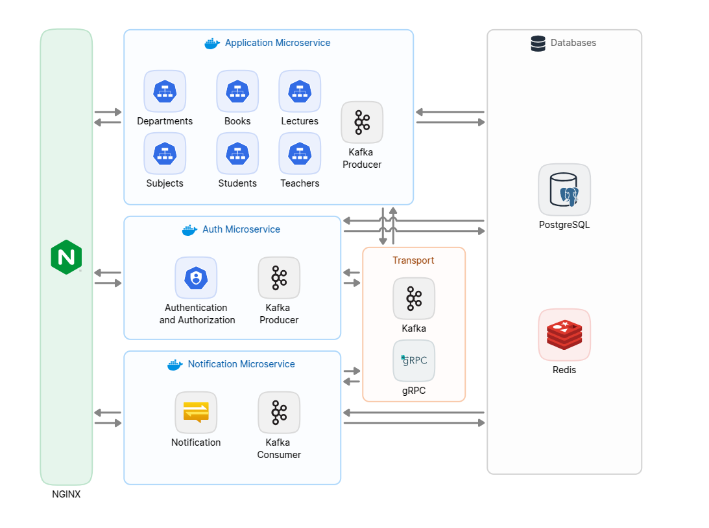

# Library System API (Microservices Architecture)

This repository contains the **Library System API**, designed with a microservices architecture to manage books, departments, lectures, students, subjects, teachers, and notifications. It is built with ASP.NET Core, utilizing PostgreSQL as the database, Redis for output caching, and Kafka for messaging.


## Project Structure

The solution is divided into the following microservices and layers : 

### Microservices and Layers

- **Library.Api**: Handles API endpoints and controllers for the library system.
- **Library.Application**: Contains business logic and application-level services.
- **Library.Auth**: Handles authentication and user management using JWT (JSON Web Token).
- **Library.Domain**: Represents the domain entities and core business rules.
- **Library.Infrastructure**: Contains infrastructure-level code like database configurations.
- **Library.Interfaces**: Defines interfaces for services and repositories.
- **Library.Notification**: Handles notifications, including creating, retrieving, and managing read/unread states.


---


## Technologies Used

- **ASP.NET Core**: Backend framework.
- **PostgreSQL**: Relational database for persisting data.
- **Redis**: Used for output caching.
- **Kafka**: Used for messaging to send and receive notifications.
- **Swagger**: API documentation and testing.
- **Nginx**: Open-source web server software used for reverse proxy.
- **JWT**: Used for secure authentication and authorization.

---

## Getting Started

### Prerequisites

Before running the application, ensure that you have the following dependencies installed:

- Docker 

### Installation

1. Clone the repository
2. Build and run the Docker containers:
```docker
docker compose up
```
3. URL http://localhost/apiService to access for API .
5. URL http://localhost/authService to access for Auth API .

## API Documentation

You can access the Swagger UI for the APIs using the following links:

- **API Documentation**: [Access Swagger for API](http://localhost:5253/swagger/index.html)
- **Authentication API Documentation**: [Access Swagger for Auth API](http://localhost:5202/swagger/index.html)
- **Notification API Documentation**: [Access Swagger for Notification API](http://localhost:5124/swagger/index.html)


## Features

### Authentication API Endpoints

#### Auth
- **POST** `/Api/Auth/Login` - User login.  
- **POST** `/Api/Auth/Register-Admin` - Register a new admin.  
- **POST** `/Api/Auth/Register-Teacher` - Register a new teacher.  
- **POST** `/Api/Auth/Register-Student` - Register a new student.  
- **GET** `/Api/Auth/Validate-Token` - Validate user authentication token.

### Library API Endpoints

#### Departments
- **GET** `/Api/Departments` - Retrieve all departments.  
- **POST** `/Api/Departments` - Add a new department.  
- **PUT** `/Api/Departments` - Update a department.  
- **GET** `/Api/Departments/{departmentId}` - Get a specific department by ID.  
- **DELETE** `/Api/Departments/{departmentId}` - Delete a specific department by ID.  

#### Books
- **GET** `/Api/Books` - Retrieve all books.  
- **POST** `/Api/Books` - Add a new book.  
- **GET** `/Api/Books/{bookId}` - Get details of a specific book by ID.  
- **DELETE** `/Api/Books/{bookId}` - Delete a specific book by ID.  
- **GET** `/Api/Books/Download/{bookId}` - Download a specific book by ID.  

#### Lectures
- **GET** `/Api/Lectures` - Retrieve all lectures.  
- **POST** `/Api/Lectures` - Add a new lecture.  
- **GET** `/Api/Lectures/{lectureId}` - Get a specific lecture by ID.  
- **DELETE** `/Api/Lectures/{lectureId}` - Delete a specific lecture by ID.  
- **GET** `/Api/Lectures/Download/{lectureId}` - Download a lecture by ID.  

#### Students
- **GET** `/Api/Students` - Retrieve all students.  
- **GET** `/Api/Students/{studentId}` - Get details of a specific student by ID.  
- **DELETE** `/Api/Students/{studentId}` - Delete a specific student by ID.  

#### Subjects
- **GET** `/Api/Subjects` - Retrieve all subjects.  
- **POST** `/Api/Subjects` - Add a new subject.  
- **PUT** `/Api/Subjects` - Update a subject.  
- **GET** `/Api/Subjects/{subjectId}` - Get details of a specific subject by ID.  
- **DELETE** `/Api/Subjects/{subjectId}` - Delete a specific subject by ID.  

#### Teachers
- **GET** `/Api/Teachers` - Retrieve all teachers.  
- **GET** `/Api/Teachers/{teacherId}` - Get details of a specific teacher by ID.  
- **DELETE** `/Api/Teachers/{teacherId}` - Delete a specific teacher by ID.

### Notification API Endpoints

#### Notification
- **GET** `/Api/Notification` - Retrieve all notifications.  
- **POST** `/Api/Notification/Send` - Send a new notification.  
- **PATCH** `/Api/Notification/{notificationId}/Read` - Mark a notification as read.  


---
